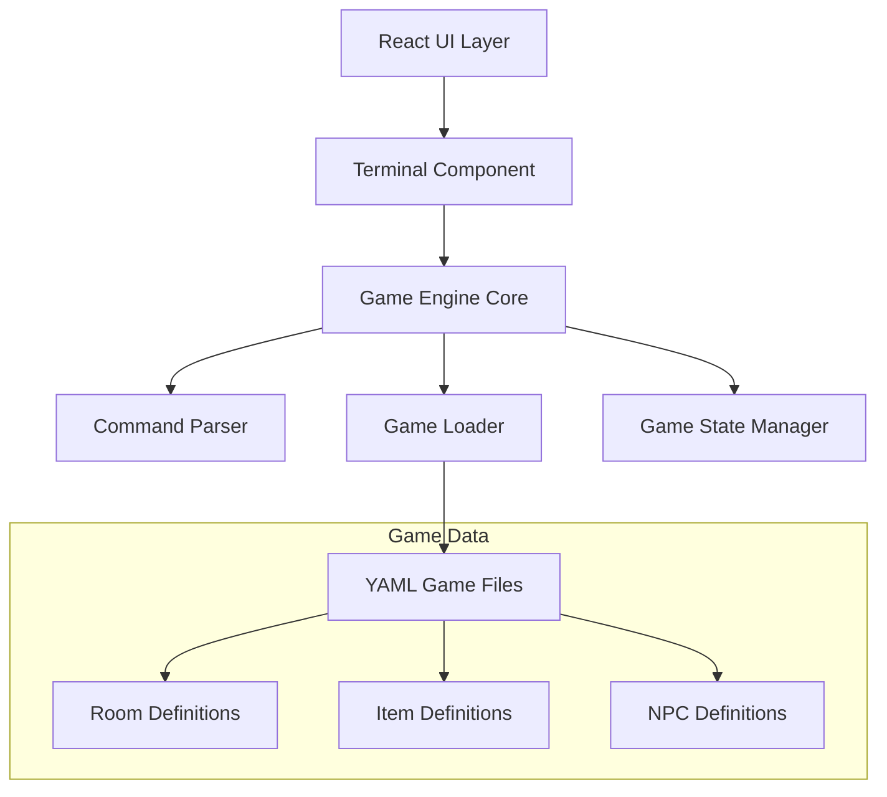

# 🏗️ Texplorer: Text Adventure Game Engine Implementation Plan

## Technology Stack Recommendations

Based on your requirements and research:

- **NLP Library**: `compromise` - Lightweight, good for simple command parsing like "go north", "take sword"
- **Terminal Library**: `@uiw/react-terminal` - Well-maintained, good React integration, customizable
- **YAML Parser**: `js-yaml` - Standard, reliable YAML parsing for Node.js/browser
- **Testing**: Jest (unit), React Testing Library (component), Playwright (e2e)

## System Architecture



## Core Architecture Components

### 1. Game Engine (Core Business Logic)
Following SOLID principles:
- **Single Responsibility**: Each class handles one aspect (Room, Item, NPC, etc.)
- **Open/Closed**: Extensible through interfaces without modifying core code
- **Liskov Substitution**: All game entities implement common interfaces
- **Interface Segregation**: Separate interfaces for different behaviors
- **Dependency Inversion**: Engine depends on abstractions, not concrete implementations

### 2. Game Data Structure
```yaml
# Example room definition
rooms:
  cave_entrance:
    name: "Cave Entrance"
    short_description: "A dark cave entrance"
    long_description: "You stand before a foreboding cave entrance..."
    exits:
      north: "dark_tunnel"
      south: "forest_path"
    items: ["torch", "rope"]
    npcs: ["old_hermit"]
```

### 3. Command Processing Pipeline
```
User Input → Tokenizer → Intent Recognition → Action Resolver → Game State Update → Response Generation
```

## Folder Structure
```
src/
├── components/           # React UI components
│   ├── Terminal/
│   ├── MenuBar/
│   └── HelpModal/
├── engine/              # Game engine core
│   ├── interfaces/      # TypeScript interfaces
│   ├── entities/        # Game entities (Room, Item, NPC)
│   ├── managers/        # State and game managers
│   └── parsers/         # Command parsing logic
├── games/               # Game definition files
│   ├── mine-explorer/
│   └── space-quest/
├── styles/              # VS Code themed CSS
├── utils/               # Utility functions
└── tests/               # Test files
```

## Implementation Phases

### Phase 1: Foundation (Items 1-4)
- Set up dependencies and TypeScript interfaces
- Create core game engine structure
- Design entity relationships

### Phase 2: Game Logic (Items 5-10)
- YAML loading system
- Command parsing and natural language processing
- Core game mechanics (movement, inventory, interactions)

### Phase 3: UI Layer (Items 11-14)
- Terminal component with VS Code styling
- Menu bar and modal system
- Integration between engine and UI

### Phase 4: Content & Testing (Items 15-21)
- Create sample games
- Comprehensive testing suite
- Browser automation testing

### Phase 5: Polish (Items 22-23)
- Performance optimization
- Error handling and edge cases
- Documentation

## Key Design Decisions

1. **Separation of Concerns**: Game logic completely isolated from UI
2. **Event-Driven Architecture**: Game engine emits events, UI responds
3. **Immutable State**: Game state changes through reducers for predictability
4. **Plugin Architecture**: Easy to extend with new command types or game features
5. **Type Safety**: Full TypeScript coverage for robust development

## Testing Strategy

- **Unit Tests**: Individual engine components (Room, Item, Parser)
- **Integration Tests**: Full game scenarios in memory
- **Component Tests**: React components in isolation
- **E2E Tests**: Full user flows with Playwright

## Game Requirements Breakdown

### Mine Explorer Game
- **Rooms**: ~12-15 connected areas (cave entrance, tunnels, dragon lair, treasure room, maze)
- **Items**: bird, cage, treasure
- **NPCs**: dragon
- **Mechanics**: 
  - Bird automatically enters cage when player enters bird's room
  - Dragon flees when cage with bird is dropped
  - Dragon fleeing reveals hidden door to maze
  - Maze navigation to treasure room
  - Win condition: reach treasure room

### Space Quest Game
- **Rooms**: ~8-10 space sectors/ship areas
- **Focus**: Simple navigation between ship sections and space sectors
- **Purpose**: Demonstrate multi-game loading capability

## Dependencies to Add
```json
{
  "compromise": "^14.x",
  "@uiw/react-terminal": "^4.x", 
  "js-yaml": "^4.x",
  "@types/js-yaml": "^4.x"
}